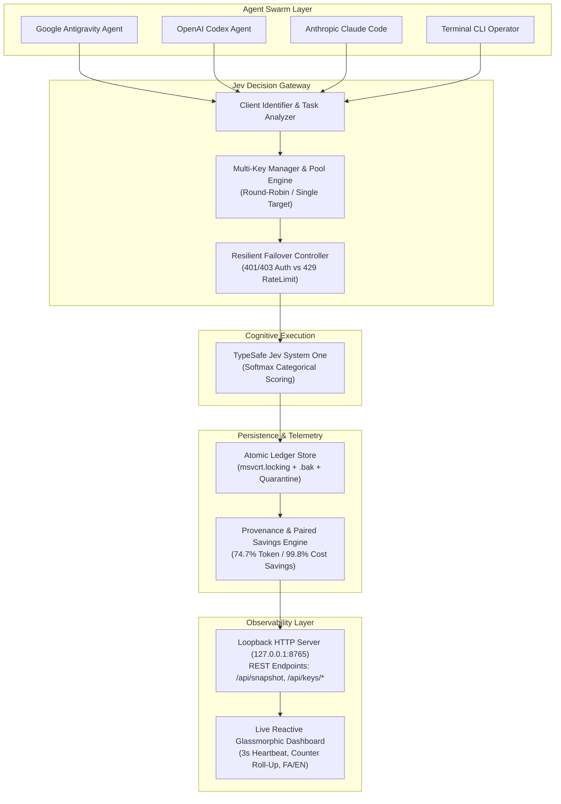
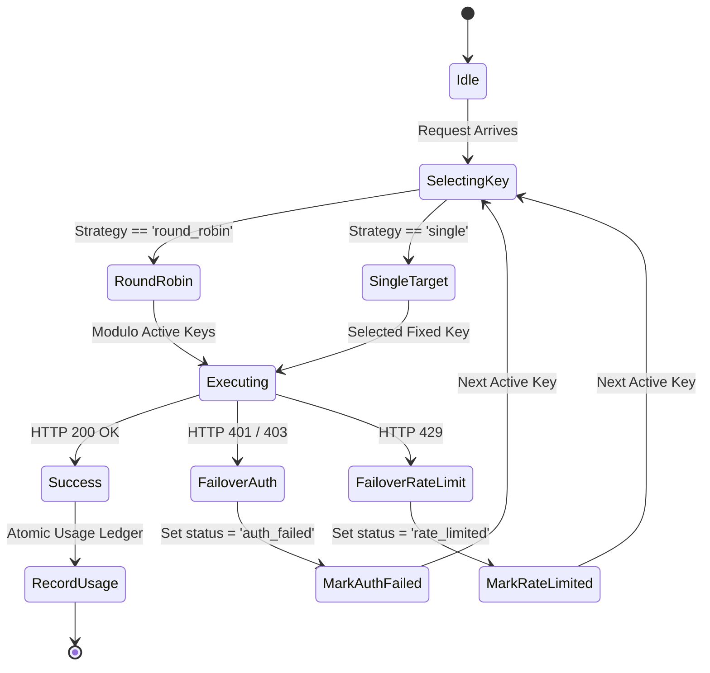

# 🏛️ Architecture & System Design: Jev Decision Layer

This document details the architectural blueprints, cognitive routing mechanics, state persistence, and telemetry algorithms of the **Jev Decision Layer**.

---

## 1. Cognitive Architecture: System One vs General LLM

When autonomous AI agents make discrete execution choices—such as selecting a framework (e.g. `Three.js` vs `Babylon.js`), picking an architectural pattern, or routing between tool handlers—traditional agent workflows invoke a multi-billion parameter LLM.

```mermaid
sequenceDiagram
    autonumber
    participant Agent as Autonomous Agent
    participant Legacy as Standard LLM (Claude 3.5 / GPT-4o)
    participant Jev as Jev Decision Layer (System One)

    rect rgb(45, 20, 20)
    Note over Agent,Legacy: Legacy LLM Flow (Heavy & Costly)
    Agent->>Legacy: Full Context + Prompt (6,500 tokens)
    Legacy-->>Agent: Reasoning + Choice (550 tokens)<br/>Cost: ~$0.027 | Latency: 2,500ms
    end

    rect rgb(20, 45, 30)
    Note over Agent,Jev: Jev System One Flow (Lean & Microsecond)
    Agent->>Jev: Bounded Choice Query (320 tokens)
    Jev-->>Agent: Softmax Distribution + Choice (0 output tokens)<br/>Cost: $0.000013 | Latency: 210ms
    end
```

### Measured Efficiencies
- **Input Token Rate**: $0.042 / 1,000,000 input tokens.
- **Output Token Rate**: $0.00 (completely free).
- **Latency**: Reduced from 2,000–3,500 ms to **p50: 210 ms**.
- **Financial Savings**: **99.8%** cost reduction per discrete decision.

---

## 2. Multi-Key Pool & Failover Lifecycle

The Key Management engine ([`bin/jev_key_manager.py`](bin/jev_key_manager.py)) manages a distributed array of API keys with configurable load-balancing heuristics:

---

## 3. Atomic Storage & Concurrency Model

High-frequency agent swarms can produce concurrent decision writes. To prevent state corruption or race conditions, [`bin/jev_ledger_store.py`](bin/jev_ledger_store.py) implements:

1. **OS-Level Mutex Locking**:
   - Uses `msvcrt.locking(f.fileno(), msvcrt.LK_NBLCK, 1)` on Windows.
   - Falls back to `fcntl.flock` on Unix systems with exponential backoff and jitter.
2. **Double-Write Resilience**:
   - Writes to a temporary staging file before atomically replacing the destination.
   - Automatically maintains a `.bak` mirror file prior to committing changes.
3. **Auto-Quarantine**:
   - If an unparseable payload is encountered, the file is instantly sequestered into a timestamped `.corrupt-<timestamp>` file, and an empty clean ledger is initialized.

---

## 4. Reactive Observability Engine

The web dashboard ([`bin/jev_dashboard_ui.py`](bin/jev_dashboard_ui.py) & [`jev_dashboard.html`](jev_dashboard.html)) operates on a real-time reactive loop:

- **Loopback Security**: The server only accepts connections from `127.0.0.1` and `[::1]`. External cross-origin requests from outside the loopback perimeter are denied with `403 Forbidden`.
- **Differential Polling**: The frontend requests `/api/snapshot` every 3,000ms. If the snapshot timestamp hasn't changed, DOM updates are bypassed to conserve client CPU cycles.
- **Roll-Up Animation**: Metric numerical values transition smoothly via requestAnimationFrame interpolation.
