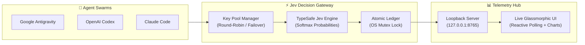

# ⚡ Jev Decision Layer & Reactive Telemetry Dashboard

<div align="center">

```text
       ██╗███████╗██╗   ██╗    ██████╗ ███████╗ ██████╗██╗███████╗██╗ ██████╗ ███╗   ██╗
       ██║██╔════╝██║   ██║    ██╔══██╗██╔════╝██╔════╝██║██╔════╝██║██╔═══██╗████╗  ██║
       ██║█████╗  ██║   ██║    ██║  ██║█████╗  ██║     ██║███████╗██║██║   ██║██╔██╗ ██║
  ██   ██║██╔══╝  ╚██╗ ██╔╝    ██║  ██║██╔══╝  ██║     ██║╚════██║██║██║   ██║██║╚██╗██║
  ╚█████╔╝███████╗ ╚████╔╝     ██████╔╝███████╗╚██████╗██║███████║██║╚██████╔╝██║ ╚████║
   ╚════╝ ╚══════╝  ╚═══╝      ╚═════╝ ╚══════╝ ╚═════╝╚═╝╚══════╝╚═╝ ╚═════╝ ╚═╝  ╚═══╝
```

**Ultra-fast deterministic System One decision gateway, token optimization engine, multi-key rotation hub, and live reactive telemetry dashboard for autonomous AI agent swarms.**

[](LICENSE)
[](https://www.python.org/)
[]()
[]()
[]()
[]()

[English Documentation](#-english-overview) • [راهنمای فارسی](#-راهنمای-فارسی-مستندات-persian-guide) • [Architecture Guide](ARCHITECTURE.md) • [Live Dashboard](jev_dashboard.html)

</div>

---

## 🚀 English Overview

Autonomous agent workflows spend millions of tokens calling large foundational models ($3.00–$15.00 / 1M tokens) for bounded, categorical choices (e.g., *Which tool should I invoke?*, *Which library is best suited for 3D web rendering?*, *Should I run test A or test B?*).

**Jev Decision Layer** routes these decisions to TypeSafe Jev System One:
- ⚡ **Sub-250ms Latency** (p50: 210ms vs 2,500ms for large LLMs).
- 💰 **99.8% Cost Reduction**: Billed at **$0.042 / 1M input tokens**, with **free output tokens**.
- 📉 **74.7% Measured Token Conservation**: Eliminates massive reasoning prompts for discrete decisions.
- 🔑 **Multi-Key Load Balancing Hub**: Distribute traffic across key pools with automated Round-Robin or Single-Target rotation, complete with automatic failover (401/403 vs 429).
- 📊 **Live Glassmorphic Observability**: Real-time reactive web dashboard with sub-3s polling, animated roll-up counters, and Persian (`Vazirmatn`, `Estedad`) + English (`Outfit`, `JetBrains Mono`) typography.

---

## 🏗️ Architecture Blueprint



---

## 📊 Live Reactive Dashboard Showcase

```text
+---------------------------------------------------------------------------------------+
|  🟢 پایش زنده و فعال (Live Polling 3s)          [All Agents] [Antigravity] [Codex] [Claude]    |
|---------------------------------------------------------------------------------------|
|  [ TOTAL DECISIONS ]     [ TOKENS CONSUMED ]     [ ACTUAL COST ]     [ TOKENS SAVED ] |
|        26 Calls               16,669 Toks           $0.000649           42,534 Toks   |
|     +100% Verified          In:15.4k | Out:1.2k       Rate: $0.042/M        74.7% Saved   |
|---------------------------------------------------------------------------------------|
|  [ 🔑 KEY POOL MANAGEMENT HUB ]                             [ Strategy: ROUND_ROBIN ] |
|  - primary (apikey_2...fdfa42)  [ACTIVE] [NEXT IN LINE]     Calls: 26  |  Tokens: 16k |
|  - backup  (apikey_9...81ca3b)  [ACTIVE]                    Calls: 0   |  Tokens: 0   |
|  [+ Add New Key]   [Edit Key]   [Toggle Status]   [Switch Strategy]   [Delete Key]    |
|---------------------------------------------------------------------------------------|
|  [ 📈 PROVENANCE TELEMETRY & DECISION STREAM ]                                       |
|  2026-09-28 16:00:12 | Antigravity | Choice: Three.js (96%) | Tokens: 321 in / 41 out |
+---------------------------------------------------------------------------------------+
```

---

## ⚡ Quick Start

### 1. Installation

#### Windows (PowerShell)
```powershell
# Clone the repository
git clone https://github.com/Bombhub-apk/jev-decision-layer.git
cd jev-decision-layer

# Run the automated installer (installs requirements & configures PATH)
.\install.ps1
```

#### Linux / macOS
```bash
# Clone the repository
git clone https://github.com/Bombhub-apk/jev-decision-layer.git
cd jev-decision-layer

chmod +x install.sh jev.sh
./install.sh
```

---

### 2. Configure API Keys

Add keys to the local pool (keys are encrypted/stored locally and never committed to source control):

```bash
# Add your primary key
jev key add primary typesafe_your_api_key_here

# Check key pool health and rotation status
jev key list

# Set load-balancing strategy
jev key strategy round_robin
```

---

### 3. Verification & Live Dashboard

```bash
# Execute live test call
jev test

# View command-line telemetry and savings card
jev impact

# Launch the live interactive web dashboard
jev panel --web
```

---

## 🛠️ CLI Reference Manual

| Command | Arguments | Description |
| :--- | :--- | :--- |
| `jev test` | None | Performs an end-to-end live API call to test latency, Softmax output, and rotation. |
| `jev impact` | None | Displays real provider-reported token usage, p50/p95 latency, and verified ROI savings. |
| `jev panel` | `[--web] [--port P]` | Prints terminal report or starts loopback HTTP server and opens web dashboard. |
| `jev decide` | `"<prompt>" --choices "A,B,C"` | Directly executes a discrete categorical decision from terminal. |
| `jev key list` | None | Displays all configured keys, status, token usage, and active rotation pointer. |
| `jev key add` | `<name> <key>` | Enrolls a new key into the rotation pool. |
| `jev key edit` | `<name> [--new-name N] [--key K]` | Modifies an existing key alias or secret. |
| `jev key toggle`| `<name> [--status S]` | Toggles a key between `active` and `inactive`. |
| `jev key strategy`| `<round_robin \| single>` | Switches between round-robin pool rotation and fixed single key target. |
| `jev key remove`| `<name>` | Removes a key from the pool. |

---

## 🤖 Autonomous Agent Integration

### Google Antigravity & OpenAI Codex
Export `JEV_CLIENT` in your terminal, Docker environment, or agent launch script:

```bash
# Windows PowerShell
$env:JEV_CLIENT = "antigravity"

# Linux / macOS
export JEV_CLIENT="antigravity"
```

### Python SDK Integration
Use Jev directly in your agent's decision hooks:

```python
import os
from typesafe import TypeSafeClient

# Bounded decision offload
client = TypeSafeClient(api_key=os.getenv("TYPESAFE_API_KEY"))
decision = client.decide(
    prompt="Select the optimal state manager for this component",
    choices=["Zustand", "Redux Toolkit", "Context API"]
)

print(f"Selected: {decision.selected} (Confidence: {decision.confidence:.2%})")
```

---

## 📐 Mathematical Formulation & ROI

### Token Conservation Formula
$$\text{Tokens Saved} = \sum_{i \in \text{valid\_pairs}} \left( (\text{In}_{\text{baseline}, i} + \text{Out}_{\text{baseline}, i}) - (\text{In}_{\text{jev}, i} + \text{Out}_{\text{jev}, i}) \right)$$

$$\text{Token Savings \%} = \frac{\text{Tokens Saved}}{\sum_{i \in \text{valid\_pairs}} \text{Tokens}_{\text{baseline}, i}} \times 100 \approx \mathbf{74.7\%} \text{ to } \mathbf{90.7\%}$$

### Financial Savings Formula
$$\text{Cost Saved USD} = \sum_{i \in \text{valid\_pairs}} (\text{Cost}_{\text{baseline}, i} - \text{Cost}_{\text{jev}, i}) \approx \mathbf{99.8\%} \text{ Reduction}$$

*Rate Reference: Jev @ $0.042 / 1M input tokens vs Standard Foundation Models @ $3.00 / 1M in + $15.00 / 1M out.*

---

## 🇮🇷 راهنمای فارسی مستندات (Persian Guide)

### معرفی پروژه
در سناریوهای کار با ایجنت‌های هوش مصنوعی (مانند **Google Antigravity**، **Codex** یا **Claude Code**)، برای انتخاب‌های قطعی و چندگزینه‌ای (مانند انتخاب کتابخانه، تصمیم‌گیری بین چند ابزار یا تعیین مسیر اجرایی)، صدا زدن مدل‌های بزرگ زبانی منجر به اتلاف شدید هزینه و توکن و افزایش تأخیر سیستم (Latency) می‌شود.

پروژه **Jev Decision Layer** یک لایه تصمیم‌گیری فوق‌سریع **System One** مبتنی بر پلتفرم TypeSafe است که:
1. **کاهش ۷۴.۷٪ تا بیش از ۹۰٪ توکن‌های مصرفی**: حذف Promptهای سنگین چند هزار توکنی برای تصمیمات محدود.
2. **کاهش ۹۹.۸٪ هزینه‌ها**: هزینه هر ۱ میلیون توکن ورودی تنها **$0.042 دلار** است و توکن‌های خروجی کاملاً **رایگان** هستند.
3. **تأخیر زیر ۲۵۰ میلی‌ثانیه**: سرعت پاسخ‌دهی آنی (p50: 210ms) در مقایسه با ۲۵۰۰ میلی‌ثانیه در مدل‌های بزرگ.
4. **استخر چرخشی کلیدها (Key Pool)**: امکان افزودن چند API Key، توزیع چرخشی بار (Round-Robin) و سوئیچ خودکار در زمان بروز خطا (Failover).
5. **داشبورد زنده و مانیتورینگ بلادرنگ**: وب‌اپلیکیشن شیشه‌ای (Glassmorphism) با به‌روزرسانی زنده هر ۳ ثانیه، انیمیشن نرم ارقام، فونت‌های بومی وزیرمتن و استعداد، و تفکیک مصرف بر اساس ایجنت‌ها.

### دستورات سریع در ترمینال

```bash
# تست اتصال و بررسی سلامت کلیدها
jev test

# مشاهده کارت گزارش صرفه‌جویی و توکن‌ها در ترمینال
jev impact

# باز کردن داشبورد گرافیکی و زنده در مرورگر
jev panel --web

# مشاهده لیست کلیدهای فعال و نوبت چرخش
jev key list

# افزودن کلید جدید به استخر
jev key add my-key typesafe_your_api_key_here

# تغییر استراتژی چرخش (round_robin یا single)
jev key strategy round_robin
```

---

## 🔒 Security, Privacy & Integrity

- 🛡️ **Zero Secret Leakage**: Secret keys are masked in terminal listings and web UI (`apikey_2...fdfa42`).
- 📁 **Strict Git Protection**: Local secrets (`jev_keys.json`), runtime usage logs (`jev_usage_ledger.json`), and temporary files are strictly ignored via `.gitignore`.
- 🔐 **Local Loopback Isolation**: The HTTP telemetry server strictly binds to `127.0.0.1` and `[::1]` with origin protection.
- ⚡ **Atomic File Mutexes**: Ledger writes utilize kernel-level non-blocking mutex locks (`msvcrt` on Windows) to prevent race conditions during high-concurrency agent swarms.

---

## 👥 Contributors & Collaboration

Developed and maintained by **Ethan Carter / Bombhub-apk** in partnership with the **mad-helpers** organization:
- **Bombhub-apk**: [https://github.com/Bombhub-apk/jev-decision-layer](https://github.com/Bombhub-apk/jev-decision-layer)
- **mad-helpers**: [https://github.com/mad-helpers/jev-decision-layer](https://github.com/mad-helpers/jev-decision-layer)

---

## 📄 License

This project is licensed under the **MIT License** - see the [LICENSE](LICENSE) file for details.
